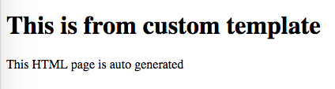

JavaScript Webpack "html-webpack-plugin" with Custom Template Demo
==================================================================

在使用"html-webpack-plugin"的时候如何指定以某个文件作为template。

需要注意的是`inject`，如果为`true`，则会在生成的html最后再inject一个`bundle.js`。
在我们的这个例子中，因为template中已经有了`bundle.js`，所以要把`inject`设为`false`。

另外，`template.html`的内容基本上来自html-webpack-plugin的默认模板：<https://github.com/jaketrent/html-webpack-template/blob/86f285d5c790a6c15263f5cc50fd666d51f974fd/index.html>

```
npm install
npm run demo
```

它将会生成`index.html`并在浏览器中打开。可以结合模板看一下生成的html的内容。


